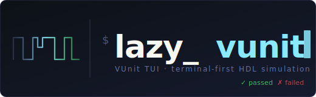

# lazy_vunit

<p align="center">
  
</p>

> **Personal tool — use at your own risk.**
> This was built for my own HDL simulation workflow. It works for me, but it has not been tested across a wide range of setups, simulators, or VUnit configurations. Pull it apart, adapt it, but don't expect polish or support.

> **Linux and macOS only.** Windows is not supported. The tool relies on Unix process signals and a Unix-style terminal environment. No Windows builds are provided.

---

```
 lazy_vunit — /home/user/project  [alu]  verbose  xunit
 ──────────────────────────────────────────────────────────────────────────────
 TESTS  ctrl+r scan              OUTPUT  tb_alu.test_add
┌───────────────────────────┐   ┌──────────────────────────────────────────────┐
│ ▼ alu                     │   │ # Running: python src/alu/run.py --verbose    │
│   ▼ tb_alu                │   │                                               │
│     ✓ test_add            │   │ Starting simulation of lib.tb_alu.test_add    │
│     ✗ test_sub            │   │ test 'lib.tb_alu.test_add' passed             │
│     ○ test_mul            │   │                                               │
│                           │   │                                               │
└───────────────────────────┘   └──────────────────────────────────────────────┘
 [alu] ✓ 1  ✗ 1  ○ 1  │  all: ✓ 1  ✗ 1  ○ 1  │  space run  g gui  s settings  q quit
```

**A keyboard-driven terminal UI for [VUnit](https://vunit.github.io/) HDL simulations.**
Navigate your test tree, run tests with a keypress, and watch output stream live — without leaving the terminal.

Inspired by [lazygit](https://github.com/jesseduffield/lazygit) — the same idea applied to HDL sim.

> **AI Disclosure:** This project was built entirely by [Claude](https://claude.ai) (Anthropic) under strict engineering guidelines — test-driven development, spec-reviewed design documents, and per-task code quality review at every step. The human provided requirements and direction only.

---

## What It Does

- **Browses** your VUnit test hierarchy as a collapsible tree
- **Runs** a single test, a whole testbench, or everything in a directory with one keypress
- **Streams** simulator output live into the output pane
- **Remembers** pass/fail results between sessions
- **Persists** run settings (flags, output path) per script
- **Multi-window** — open multiple `run.py` scripts and switch between them
- **GUI mode** — launch the simulator GUI for a single test with `g`

---

## Requirements

| Dependency | Notes |
|---|---|
| [Go 1.21+](https://golang.org/dl/) | To build the binary |
| [Python 3](https://www.python.org/) | Runtime for VUnit |
| [VUnit](https://vunit.github.io/installing.html) | `pip install vunit-hdl` |
| A HDL simulator | [GHDL](https://github.com/ghdl/ghdl), ModelSim, Questa, Riviera-PRO, etc. |

lazy_vunit doesn't bundle anything — it just invokes your existing `run.py` scripts.

---

## Installation

```bash
git clone https://github.com/lazyvunit/lazy_vunit.git
cd lazy_vunit
go build -o ~/.local/bin/lazy_vunit .
```

Ensure `~/.local/bin` is on your `$PATH`, then just run `lazy_vunit` from inside your HDL project.

---

## Usage

### Launching

```bash
cd /path/to/hdl/project
lazy_vunit
```

- Searches for `run.py` files **at or below your current directory**
- Skips Python environment folders automatically (`.venv`, `venv`, `__pycache__`, `.tox`, etc.)
- **One script found?** Launches straight in, no picker
- **Multiple scripts?** Shows a picker — select with `↑`/`↓`/`enter`

---

### Keybindings

#### Test Tree

| Key | Action |
|---|---|
| `↑` / `↓` | Move cursor |
| `→` | Expand node |
| `←` | Collapse node |
| `space` | Run selected test / testbench / directory |
| `g` | Run selected test in simulator GUI *(single test only)* |
| `x` | Cancel in-progress run |
| `ctrl+r` | Re-scan the test hierarchy |

#### Windows

| Key | Action |
|---|---|
| `[` | Previous script window |
| `]` | Next script window |

#### General

| Key | Action |
|---|---|
| `s` | Open / close settings panel |
| `?` | Open / close keybindings help |
| `esc` | Close any open panel |
| `q` | Quit |

---

### Settings Panel

Press `s` to open. Navigate with `↑`/`↓`, toggle with `space`.

| Setting | VUnit flag | Effect |
|---|---|---|
| `clean` | `--clean` | Wipe the output directory before each run |
| `verbose` | `--verbose` | Print all test output |
| `compile only` | `--compile` | Compile only, skip simulation |
| `elaborate only` | `--elaborate` | Elaborate only, skip simulation |
| `fail fast` | `--fail-fast` | Stop on first failure |
| `xunit xml` | `--xunit-xml` | Write JUnit report to `.lazyvunit/<key>_report.xml` |
| `output-path` | `--output-path` | Custom output directory *(relative to git root)* |

`output-path` is a text field — navigate to it, press `space` to start typing, `enter` to confirm, `esc` to cancel.

Active settings are shown as dim indicators in the header bar:

```
lazy_vunit — /project  [alu]  verbose  fail-fast  out:sim/vunit_out
```

---

## Persistence

On first run, `.lazyvunit/` is created at your git root and added to `.gitignore`.

```
.lazyvunit/
  <key>_results.json     ← pass/fail history
  <key>_settings.json    ← flags and output path
  <key>_report.xml       ← xunit report (when enabled)
```

`<key>` is derived from the script's path relative to the git root, with `/` replaced by `_`.

---

## Script Discovery

1. Walks downward from your current directory looking for files named `run.py`
2. If none found, falls back to scanning `.py` files for `VUnit.from_argv` + `if __name__ == "__main__"`
3. Always skips:

```
.venv  venv  env  .env  virtualenv  .tox  .nox
__pycache__  .mypy_cache  .ruff_cache  node_modules  .git
```

---

## Inspiration

Directly inspired by [lazygit](https://github.com/jesseduffield/lazygit) by Jesse Duffield — the conviction that the right terminal UI can make a complex tool feel completely natural. lazygit does that for git. lazy_vunit tries to do the same for HDL simulation.

---

## Built With

- [Bubble Tea](https://github.com/charmbracelet/bubbletea) — terminal UI framework
- [Lip Gloss](https://github.com/charmbracelet/lipgloss) — terminal layout and styling
- [VUnit](https://vunit.github.io/) — HDL simulation framework
